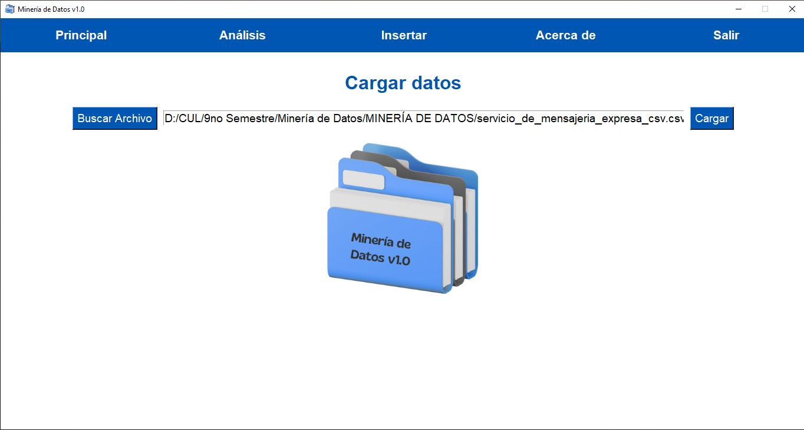
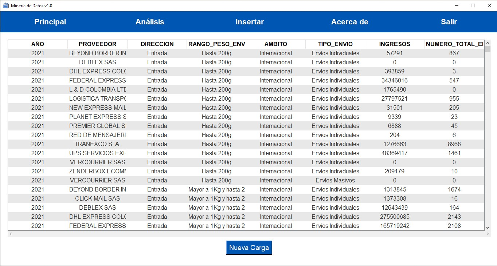
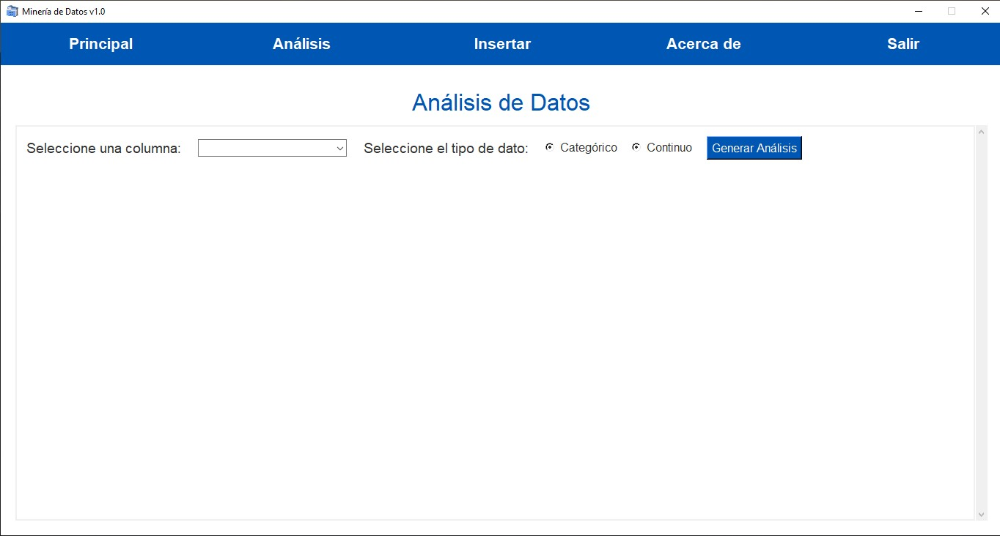
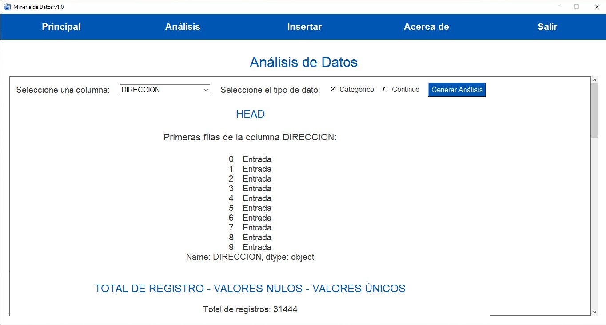
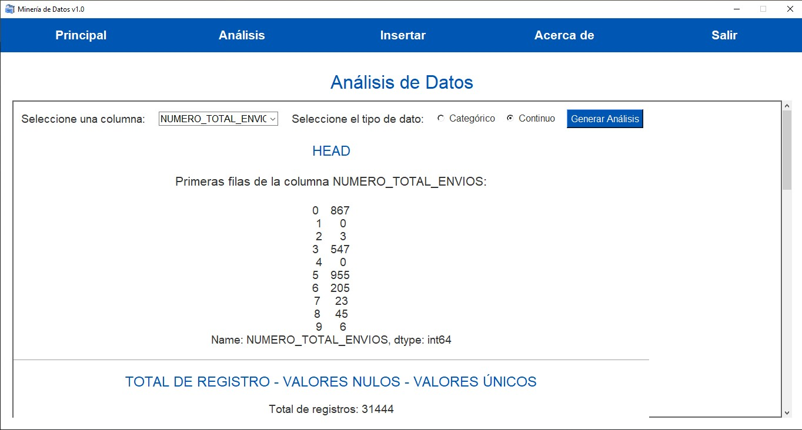
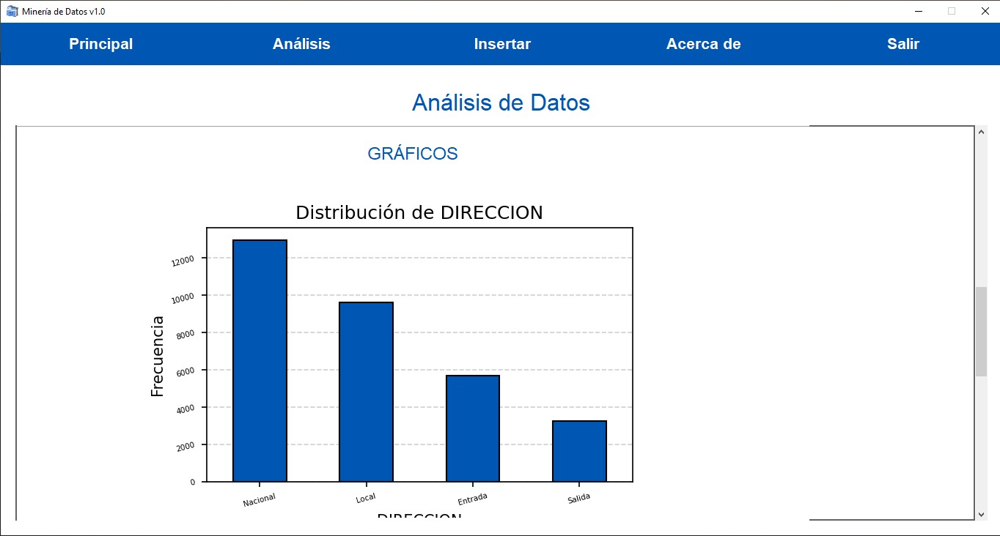
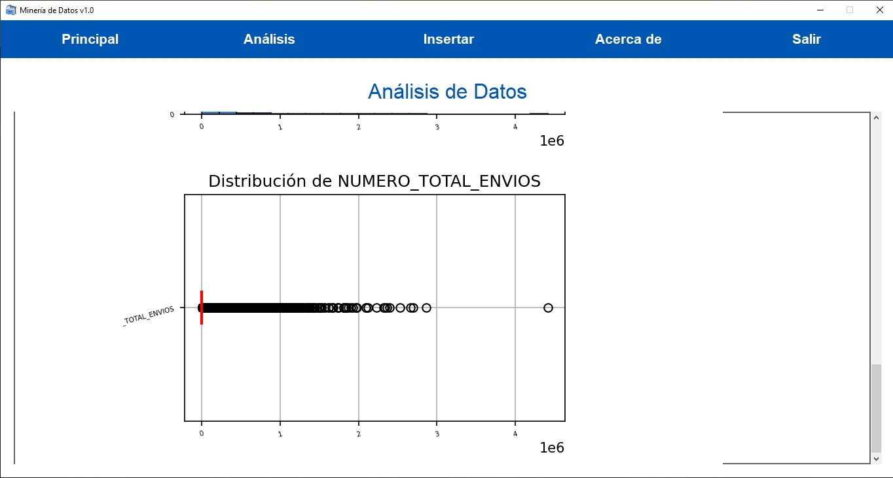
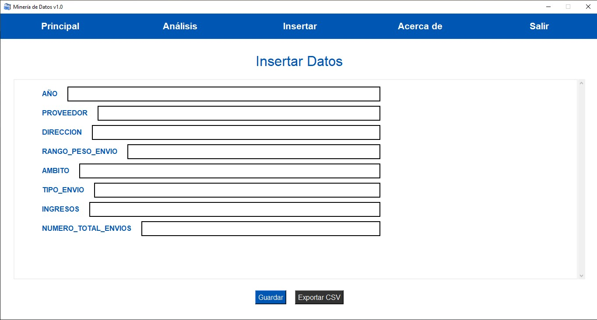
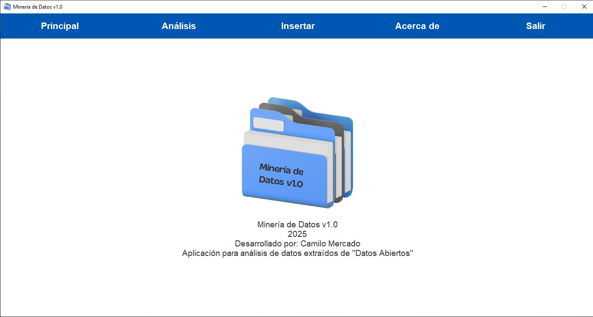

# Minería de Datos v1.0

Aplicación de escritorio en Python para análisis y gestión local de archivos CSV, con interfaz gráfica basada en `tkinter`, análisis estadístico con `pandas` y visualización gráfica con `matplotlib`.

## Descripción General

**Minería de Datos v1.0** es una herramienta de escritorio que permite cargar, analizar, visualizar y modificar archivos de datos de manera local, sin depender de bases de datos externas ni servicios en la nube. Su interfaz gráfica está diseñada para ser intuitiva y visualmente atractiva, facilitando la exploración y manipulación de datos para usuarios de todos los niveles.

## Dependencias Principales

- `tkinter` (interfaz gráfica)
- `pandas` (análisis de datos)
- `matplotlib` (visualización)
- `chardet` (detección de codificación de archivos)

## Estructura del Proyecto

```bash
mineria_de_datos_POO/
│
├── mineria.py
├── requirements.txt
├── notas.txt
├── images/
│   ├── captures/
└── .gitignore
```

## Estructura de la Aplicación

La aplicación está dividida en varias secciones principales, accesibles desde una barra de menú superior:

### 1. Principal

- Permite seleccionar y cargar archivos CSV desde el explorador de archivos.

    
    *Figura 1: Vista de la sección "Principal" al abrir el aplicativo.*

    
    *Figura 2: Vista de la sección "Principal" luego de seleccionar el archivo CSV que se va a analizar.*

- Muestra los datos en una tabla interactiva.

    
    *Figura 3: Vista de la sección "Principal" luego de cargar el archivo.*

### 2. Análisis

- Permite seleccionar una columna y su tipo de dato (categórico o continuo).

    
    *Figura 4: Vista de la sección "Análisis".*

- Genera análisis estadísticos automáticos:
  - Primeras filas (`head`)
  - Conteo de registros, valores nulos y únicos
  - Estadísticas descriptivas (`describe`)

    
    *Figura 5: Vista de la sección "Análisis" para análisis estádistico datos categóricos.*

    
    *Figura 6: Vista de la sección "Análisis" análisis estádistico para datos continuos.*

- Gráficos automáticos según el tipo de dato:
  - Datos categóricos: de barras y de torta.

    
    *Figura 7: Vista de la sección "Análisis" para análisis gráfico para datos categóricos.*

  - Datos continuos: histograma y caja de bigotes.

    
    *Figura 8: Vista de la sección "Análisis" para análisis gráfico para datos continuos.*

### 3. Insertar

- Genera un formulario dinámico para agregar nuevos registros, adaptado a las columnas del archivo cargado.
- Permite guardar el nuevo registro y actualizar la tabla.
- Opción para exportar la data actualizada a un nuevo archivo CSV.

    
    *Figura 9: Vista de la sección "Insertar" con forumario dinámico.*

### 4. Acerca de

- Muestra información sobre la aplicación, versión, año y autoría.
- Incluye el logo y una breve descripción del propósito del software.

    
    *Figura 10: Vista de la sección "Acerca de".*

### 5. Salir

- Solicita confirmación antes de cerrar la aplicación para evitar pérdidas accidentales de datos.

## Instalación y Ejecución

1. Instala las dependencias:

   ```bash
   pip install -r requirements.txt
   ```

2. Ejecuta la aplicación:

   ```bash
   python mineria.py
   ```

*Para dudas o sugerencias, crea un issue en el repositorio.*
